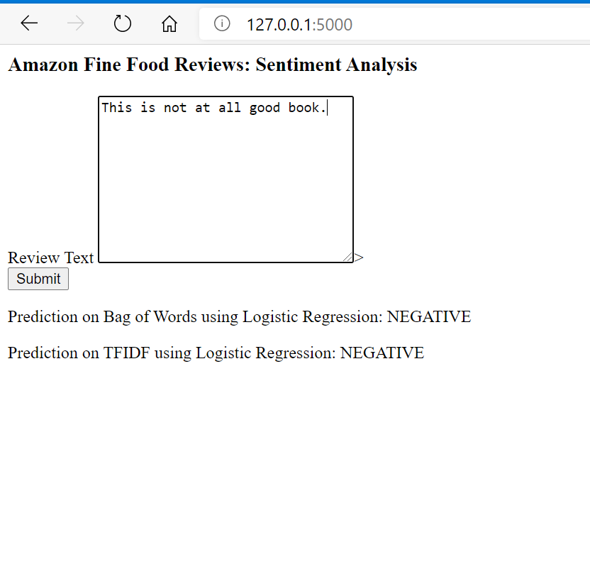
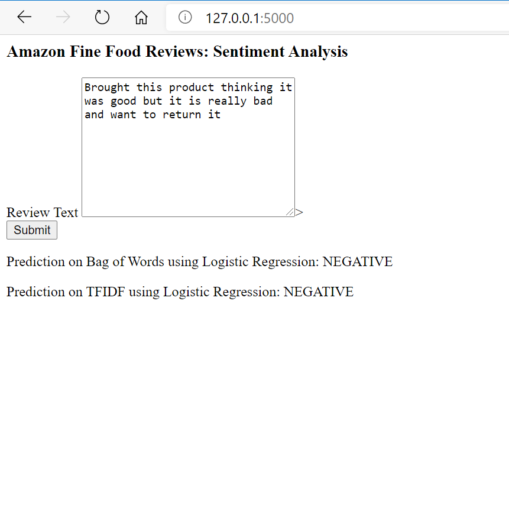
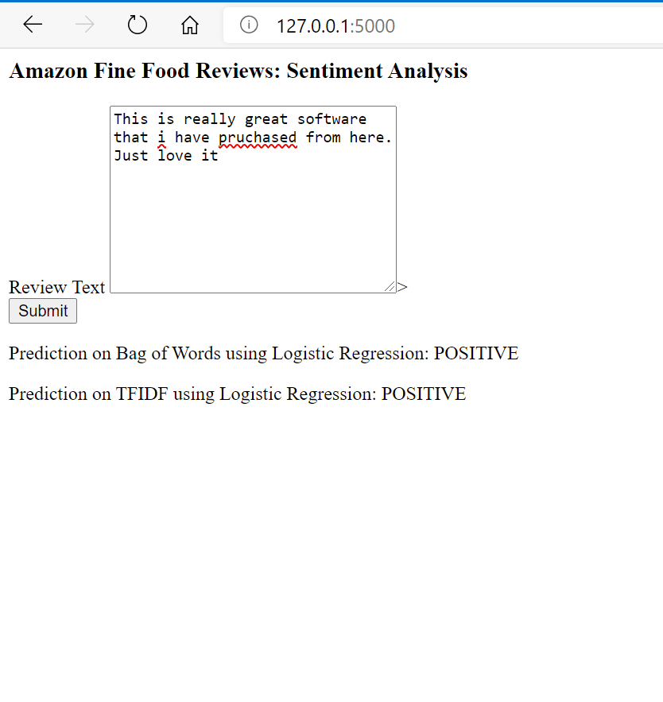
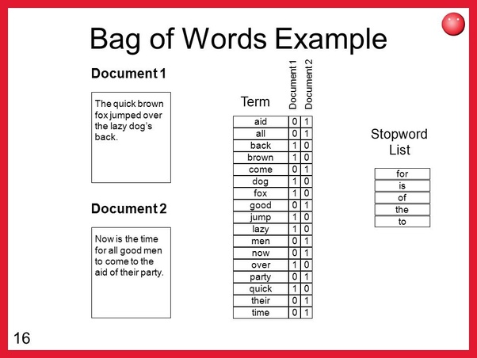

# Amazon_Fine_Food_Review

**Sentiment Analysis of the Amazon Fine Food Review competition from Kaggle**

**Data Source:** https://www.kaggle.com/snap/amazon-fine-food-reviews

The Amazon Fine Food Reviews dataset consists of reviews of fine foods from Amazon.

- Number of reviews: 568,454
- Number of users: 256,059
- Number of products: 74,258
- Timespan: Oct 1999 - Oct 2012
- Number of Attributes/Columns in data: 10

### Attribute Information:

- Id
-ProductId - unique identifier for the product
- UserId - unqiue identifier for the user
- ProfileName
- HelpfulnessNumerator - number of users who found the review helpful
- HelpfulnessDenominator - number of users who indicated whether they found the review helpful or not
- Score - rating between 1 and 5
- Time - timestamp for the review
- Summary - brief summary of the review
- Text - text of the review

## Objective:
Given a review, determine whether the review is positive (Rating of 4 or 5) or negative (rating of 1 or 2).

### [Q] How to determine if a review is positive or negative?

**[Ans]** We could use the Score/Rating. A rating of 4 or 5 could be cosnidered a positive review. A review of 1 or 2 could be considered negative. A review of 3 is nuetral and ignored. This is an approximate and proxy way of determining the polarity (positivity/negativity) of a review.

### Steps to Solve
1. Clean the given text data
2. Convert the text data into vectors using NLTK (Bag of Words, TFIDF, word2vec etc.)
3. Apply classification algorithm like logistic regression

## Screenshots of the app

### What is bag of words
The bag-of-words model is a simplifying representation used in natural language processing and information retrieval (IR). In this model, a text (such as a sentence or a document) is represented as the bag (multiset) of its words, disregarding grammar and even word order but keeping multiplicity. The bag-of-words model has also been used for computer vision.

The bag-of-words model is commonly used in methods of document classification where the (frequency of) occurrence of each word is used as a feature for training a classifier.
[wikipedia](https://en.wikipedia.org/wiki/Bag-of-words_model)

[image taken from](https://www.quora.com/What-is-the-bag-of-words-algorithm)

### what is TFIDF
In information retrieval, tf–idf, TF*IDF, or TFIDF, short for term frequency–inverse document frequency, is a numerical statistic that is intended to reflect how important a word is to a document in a collection or corpus.[1] It is often used as a weighting factor in searches of information retrieval, text mining, and user modeling. The tf–idf value increases proportionally to the number of times a word appears in the document and is offset by the number of documents in the corpus that contain the word, which helps to adjust for the fact that some words appear more frequently in general. tf–idf is one of the most popular term-weighting schemes today. A survey conducted in 2015 showed that 83% of text-based recommender systems in digital libraries use tf–idf.

Variations of the tf–idf weighting scheme are often used by search engines as a central tool in scoring and ranking a document's relevance given a user query. tf–idf can be successfully used for stop-words filtering in various subject fields, including text summarization and classification.
[Wikipedia](https://en.wikipedia.org/wiki/Tf%E2%80%93idf)

[images taken from](https://towardsdatascience.com/tf-term-frequency-idf-inverse-document-frequency-from-scratch-in-python-6c2b61b78558)

### ML Technologies Used
- Pandas
- Sklearn
- BeautifulSoup
- NLTK
- Matplotlib
- Seaborn

### Web Technologies
- Flask
- HTML
- AWS (For EC2 deployment)

### How to run
To run this app locally you will need to install the packages mentioned

`python app.py`

open the browser and go to [127.0.0.1:5000/](127.0.0.1:5000/) and enter the text for review

